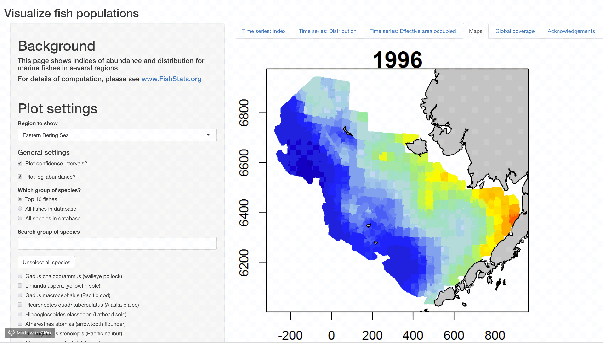
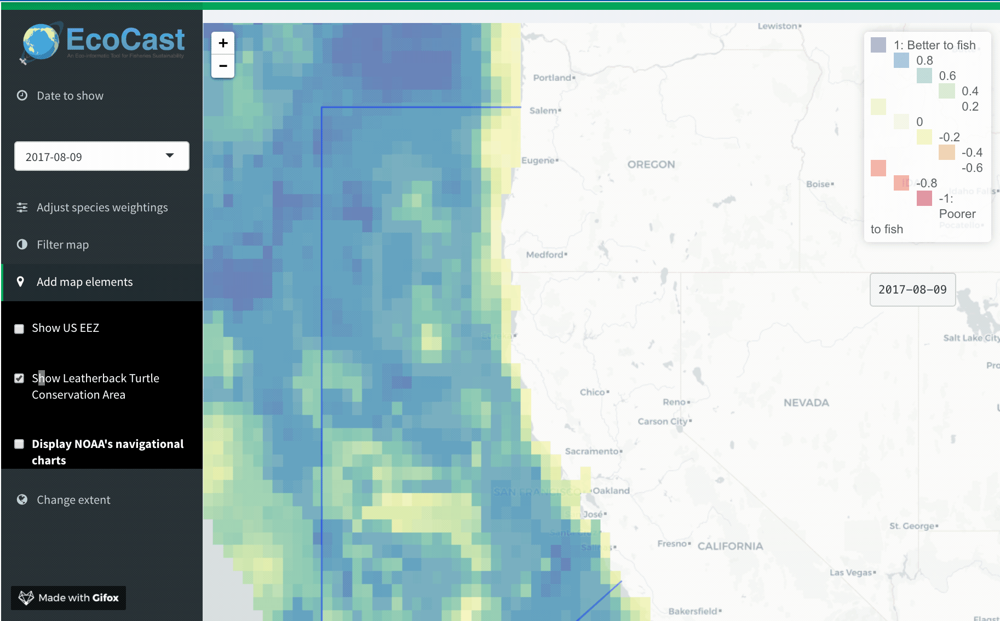

```{r setup, include=FALSE}
knitr::opts_chunk$set(echo = TRUE,fig.width = 8, collapse = TRUE)
#knitr::opts_chunk$set()
library(shiny)
library(leaflet)
```
# Shiny basics

## Why Shiny?

__Major uses__  

- making tools for people
- communicating science
- teaching

## Fisheries tools that use Shiny



## Fisheries tools that use Shiny



## Shiny basics

__How it works__  

- user interface & server logic
- ui shows inputs and outputs
- server performs all the operations
- super flexible! you can write in HTML or 

## An example
<div class="columns-2">
```
ui <- fluidPage(

   titlePanel("Old Faithful Geyser Data"),
   
   # Sidebar layout for whole document
   sidebarLayout(
      sidebarPanel(
         sliderInput("bins",
                     "Number of bins:",
                     min = 1,
                     max = 50,
                     value = 30)
      ),
      
      # Show output
      mainPanel(
         plotOutput("distPlot")
      )
   )
)
```

## Server logic
```
server <- function(input, output) {
   
   output$distPlot <- renderPlot({
      # generate bins based on input$bins from ui.R
      x    <- faithful[, 2] 
      bins <- seq(min(x), max(x), length.out = input$bins + 1)
      
      # draw the histogram with the specified number of bins
      hist(x, breaks = bins, col = 'darkgray', border = 'white')
   })
}
```

## Try an example!
 - Data are in GitHub repo


