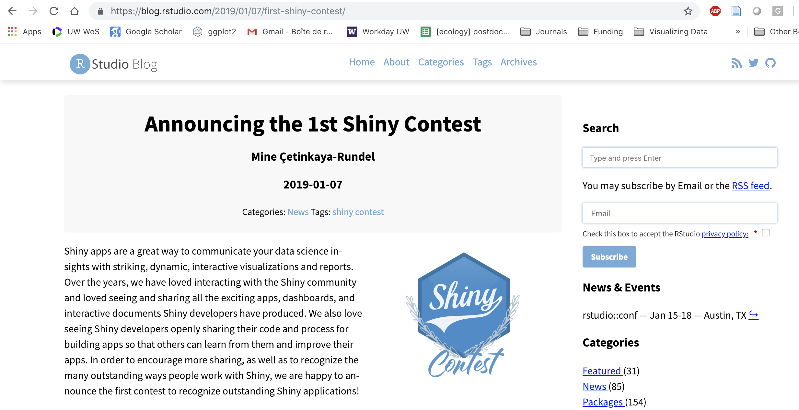

## Publishing and sharing
Once you've made an app, you can share them via:

 - web-based apps
 - online dashboards
 - [embed them in Markdown files](https://r4ds.had.co.nz/r-markdown-formats.html)

## To share them online:
- install `rsconnect` 
- sign up for a shinyapps.io account (instructions [here](http://shiny.rstudio.com/articles/shinyapps.html))
- get a token and publish straight from RStudio

## If you are very excited about Shiny...
Enter the contest!!!!

# Other Shiny tidbits

## My :roll_eyes: can be your :heavy_check_mark:

 - if you have a total crash when publishing, check your parentheses! `)}` then check your commas
 - other helpful pointers...?

## Other useful tips and tricks
 - `print()` to the RStudio console to confirm that objects are what you think they are
 - if you want to save data or outputs and use in several server operations, use `reactive` 
 - use `kableExtra` to make nice tables
 - use `ggplotly` to make interactive plots (e.g., click to see data)
 
## Overall Shiny: helpful resources
 - Dean Attali's [Shiny tutorial](https://deanattali.com/blog/building-shiny-apps-tutorial/) and general Shiny advice 
 - DataCamp has a couple of free online [Shiny courses](https://www.datacamp.com/search?q=shiny), including a lesson on building dashboards 
 - For `leaflet` in Shiny, the [Rstudio leaflet intro](https://rstudio.github.io/leaflet/shiny.html)

